# dotfiles

This was a personal SwayFX rice for myself; since a few of you asked for the
dotfiles, I'm posting them here. I'd like to be helpful, and some of you might
be new to this kind of thing (or not), so that's why the README is a bit
detailed. Don't cringe on me, please.

> **Important:** a few of these configurations might work, might not; there
> could be bugs and what-not. It works on *my* system, but I don't know about
> yours. It was only tested on a single-monitor 1920x1080 display; no idea about
> anything else. If you just want to steal the bar or the quickmenu config,
> that's totally fine. But if you're going to literally use this whole thing as
> your system, I won't be liable if it breaks anything. If you really want
> something fixed and don't know how, open an issue; depending on how
> free/busy I am, I might patch it and let you know.
>also since i use ethernet my internet is automatically connected, dont use Bluetooth to i havent created the wifi connect menu and such id you need it you can add that yourself 
## What you get

Everything here drops straight into `~/.config/` and gives you a **SwayFX**
setup with a **Quickshell** bar (three variants), one shared control menu with
all the pages, a lockscreen, on-screen volume/notification displays, plus
kitty, rofi, nvim and fastfetch configs.

### Bars

Three bar variants, switched with `activeBar` in `quickshell/bar/settings.js`:

- **Fox**: a foxes themed bottom bar.
- **Lonely**: a single-colour accent bar (focused workspace + window title
  share the lightest matugen tone, inactive workspaces get darkened chips).
- **Nerv**: an Evangelion theme: the EVA backdrop plus character icons on the
  bar, lock and power menu.

`fox` and `lonely` are just the names I gave them, no particular reason.

<table>
  <tr>
    <td align="center"><b>Fox</b><br>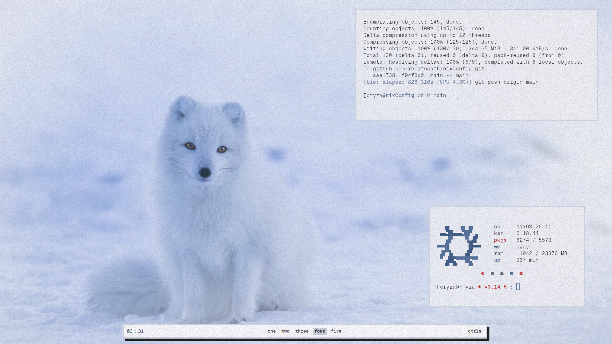<br>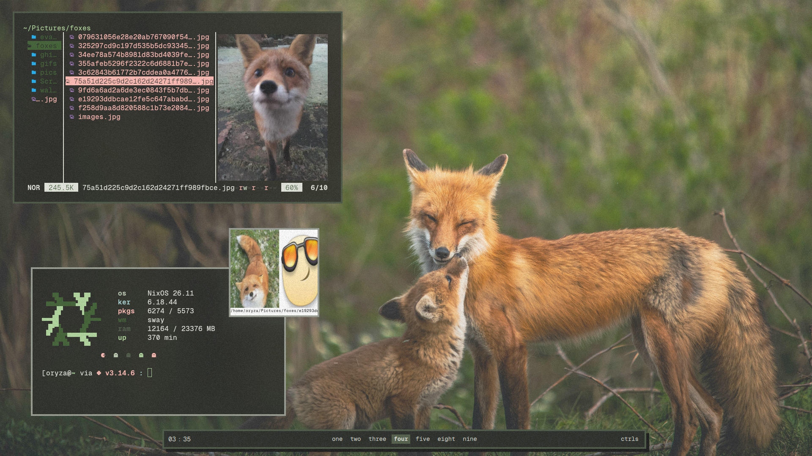</td>
    <td align="center"><b>Lonely</b><br>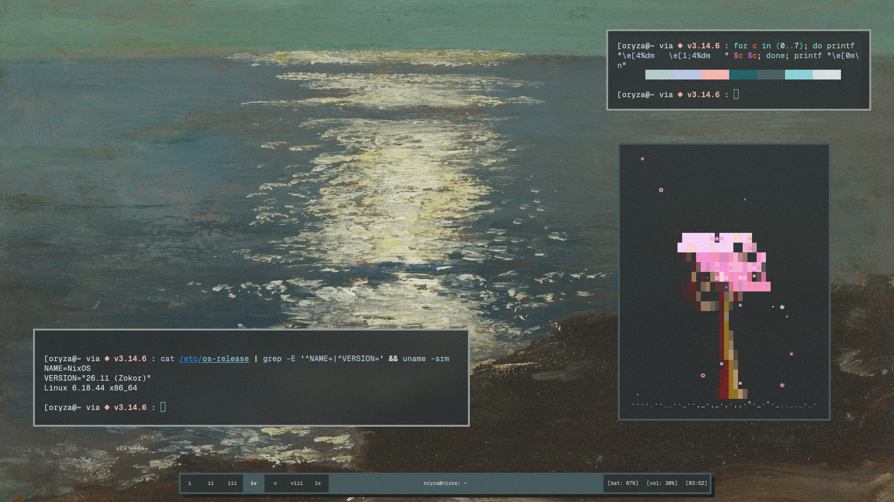<br>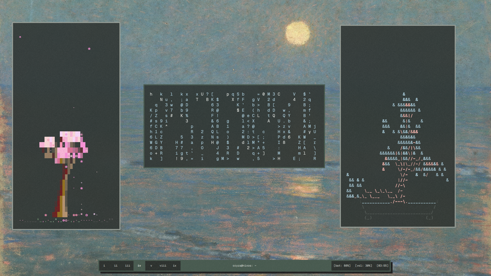</td>
    <td align="center"><b>Nerv</b><br>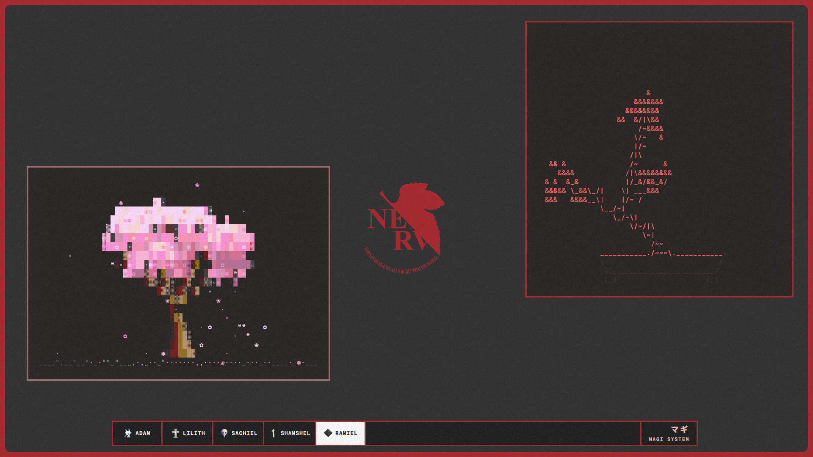<br>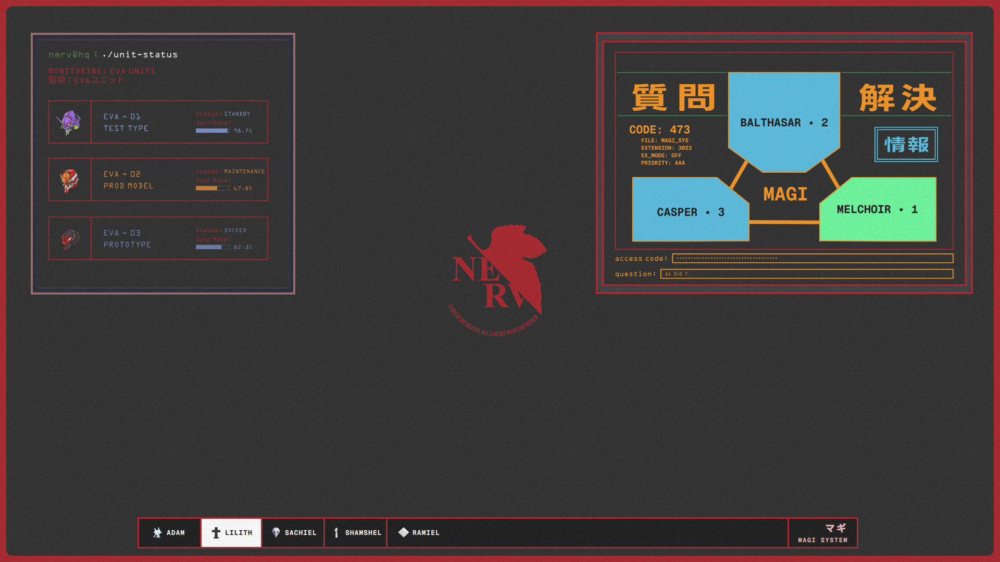</td>
  </tr>
</table>

### Control menu

There is one shared control menu (the Quickshell quick menu) used by every bar.
All bars open it by clicking a spot in their own layout:

- **Fox**: click the `ctrls` button on the right.
- **Lonely**: click any of the right info blocks (`[bat]`, `[vol]`, `[time]`).
- **Nerv**: click the `MAGI SYSTEM` label on the right.

The menu's colours follow the bar. For **nerv** the whole control center is the
fixed EVA red and cannot be rethemed at runtime; for **fox** and **lonely** it
picks up the wallpaper-derived matugen palette, so it follows whatever
wallpaper you apply.

The menu is the **control center** (bluetooth, wifi, brightness, volume, media)
plus a set of pages, each with its own panel (the control center recolours live
when you change the wallpaper for fox/lonely; the nerv control center is always
the fixed EVA red):

<table>
  <tr>
    <td align="center"><br><b>Control center</b></td>
    <td align="center"><br><b>Wallpaper picker</b></td>
    <td align="center"><br><b>Tweaks</b></td>
    <td align="center"><br><b>Clipboard</b></td>
  </tr>
  <tr>
    <td align="center">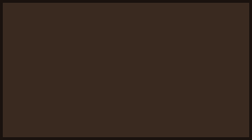<br><b>Notifications</b></td>
    <td align="center"><br><b>Power menu</b></td>
    <td align="center">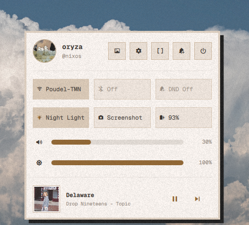<br><b>Recolours with wallpaper</b></td>
    <td align="center">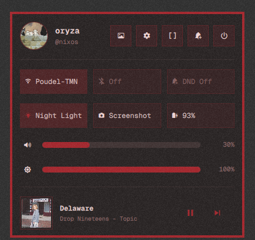<br><b>Nerv control center (fixed red)</b></td>
  </tr>
</table>

### Lockscreen & Tweaks / settings

`Super+L` locks with the blurred-wallpaper Quickshell lockscreen. `Super+W`
opens the tweaks page (the same panel you'll see in the control
menu above).

<table>
  <tr>
    <td align="center">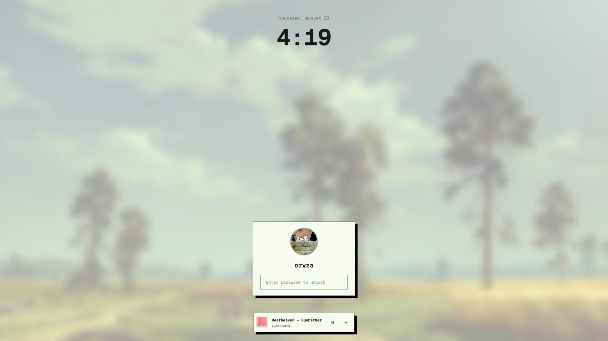<br><b>Lockscreen: Super+L</b></td>
    <td align="center">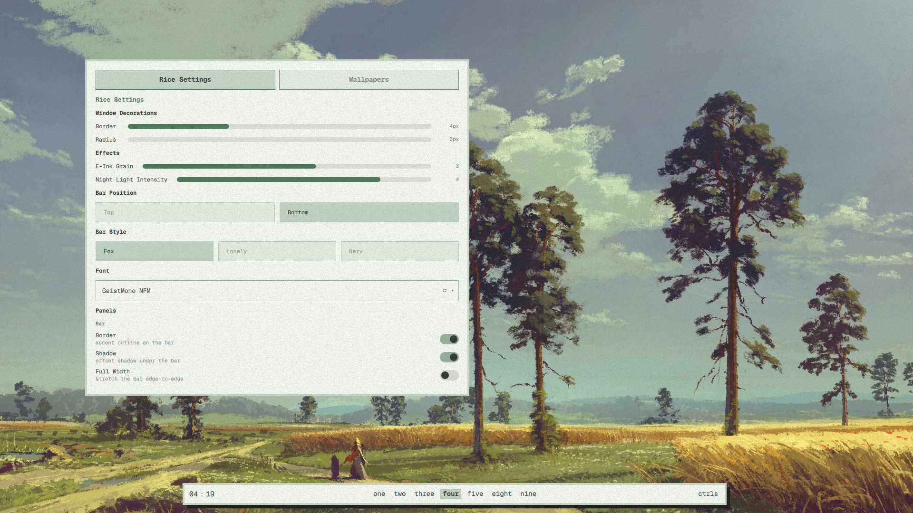<br><b>Tweaks / settings: Super+W</b></td>
  </tr>
</table>

### On-screen displays

<table>
  <tr>
    <td align="center">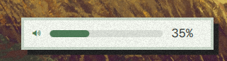<br><b>Volume OSD</b></td>
    <td align="center">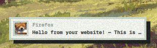<br><b>Notification OSD</b></td>
  </tr>
</table>

The bar also drives its own OSDs for volume and brightness (`XF86` media keys,
see [Keybindings](#keybindings)). You can tweak which control-menu pages appear
and how things behave; the pages and hotkeys live in
`quickshell/bar/QuickMenu.qml`.

## Keybindings

`$mod` is `Mod4` (the Windows / Super key). The important ones:

| Keybinding           | Action                                                      |
|----------------------|-------------------------------------------------------------|
| `$mod+Return`        | Open terminal (kitty)                                       |
| `$mod+Shift+Return`  | Open terminal in floating mode                              |
| `$mod+E`             | File manager (nautilus)                                     |
| `$mod+R`             | App launcher (rofi)                                         |
| `$mod+Q`             | Close focused window                                        |
| `$mod+V`             | Toggle floating                                             |
| `$mod+W`             | Wallpaper picker                                            |
| `$mod+Shift+W`       | Theme-switch (recolour from wallpaper)                      |
| `$mod+Shift+S`       | Region screenshot (saves + copies to clipboard)             |
| `$mod+Shift+F10`     | Full-screen screenshot (saves + copies to clipboard)        |
| `$mod+M`             | Power menu                                                  |
| `$mod+n`             | Notifications                                               |
| `$mod+Shift+v`       | Clipboard history                                           |
| `$mod+Shift+i`       | Tweaks / settings                                           |
| `$mod+b`             | Toggle bar visibility                                       |
| `$mod+l`             | Lock screen                                                 |
| `$mod+F10` / `Print` | Toggle screen recording                                     |
| `$mod+Shift+R`       | Reload sway config                                          |
| `$mod+Shift+X`       | Exit sway                                                   |
| `$mod+1`…`$mod+0`    | Switch to workspace 1–10                                    |
| `$mod+Shift+1`…`0`   | Move container to workspace 1–10                            |
| `$mod+J`             | Toggle layout split                                         |
| `$mod+Left/Right/Up/Down` | Move floating window                                  |
| `$mod+S`             | Show scratchpad                                             |
| `$mod+Shift+minus`   | Move container to scratchpad                                |
| `$mod+ScrollUp/Down` | Previous / next workspace                                   |
| `XF86AudioRaise/LowerVolume` | Volume up/down (with OSD)                         |
| `XF86AudioMute`      | Mute (with OSD)                                              |
| `XF86AudioMicMute`   | Toggle microphone mute                                      |
| `XF86MonBrightnessUp/Down` | Brightness up/down (with OSD)                     |
| `XF86AudioNext/Play/Pause/Prev` | Playerctl media control                       |

## Install

Clone and symlink the dirs you want into `~/.config/`:

```sh
git clone https://github.com/rebatnaath/dotfiles ~/dotfiles
ln -sf ~/dotfiles/sway ~/.config/sway
ln -sf ~/dotfiles/quickshell ~/.config/quickshell
ln -sf ~/dotfiles/kitty ~/.config/kitty
ln -sf ~/dotfiles/rofi ~/.config/rofi
ln -sf ~/dotfiles/nvim ~/.config/nvim
ln -sf ~/dotfiles/fastfetch ~/.config/fastfetch
```

## Wallpapers

The wallpaper directory is **not part of this repo**; it lives in
[nixConfig](https://github.com/rebatnaath/nixConfig)`/assets/walls`. After
cloning/symlinking, point the scripts at your own wallpaper folder by editing
the `WALLS` path in these two files:

- `sway/scripts/wall-pick`: change the `WALLS` line to your wallpaper
  directory (or export a `WALLS_DIR` env var instead):

  ```sh
  WALLS="${WALLS_DIR:-$HOME/nixConfig/assets/walls}"
  ```

- `sway/scripts/theme-switch`: update the `NERV_WALL` fallback defaults and
  the restore-image path to your own images:

  ```sh
  NERV_WALL="$HOME/nixConfig/assets/walls/eva/main.png"
  [[ -f "$NERV_WALL" ]] || NERV_WALL="$HOME/nixConfig/assets/walls/sand-dune.jpg"
  update_wall_link "$HOME/nixConfig/assets/walls/sand-dune.jpg"
  ```

## Requirements

This `~/.config`-managed rice targets my NixOS desktop; the full package list
lives in the [nixConfig](https://github.com/rebatnaath/nixConfig) flake. This
repo holds only the configs themselves. On a non-NixOS distro you'll want at
least:

- **SwayFX** (or sway) with XWayland
- **Quickshell** for the bar, OSD, notifications, picker and lockscreen
- **matugen** to derive the colour scheme from your wallpaper
- **swaybg** (wallpaper) and **swayidle** (auto-lock)
- **grim** + **slurp** (screenshots), **wl-clipboard** (clipboard)
- **cliphist** (clipboard history), **wl-screenrec** (recording)
- **brightnessctl**, **wireplumber**, **libnotify**, **playerctl**
- **ImageMagick** for wallpaper thumbnails and the lock-screen blur
- **kitty** (default terminal) and **rofi** (app launcher)

See the [nixConfig](https://github.com/rebatnaath/nixConfig) readme for the
full dependency list.

## GNOME widget extensions

If you run GNOME (or have friends or family who do) and want a widget extension,
here's one I made: [**gridgets**](https://rebatnaath.github.io/gridgets/). It's currently **awaiting review** on the GNOME
extensions portal, so install at your own risk until it lands. you can read more about it on [user guide](https://github.com/rebatnaath/gridgets/blob/main/assets/github/user-guide/README.md), [github repo](https://github.com/rebatnaath/gridgets)

<video src="assets/gridgets-schowcase.webm" controls></video>

A few of the widgets it comes with:

<table>
  <tr>
    <td align="center"><a href="assets/gridgets-weather.svg">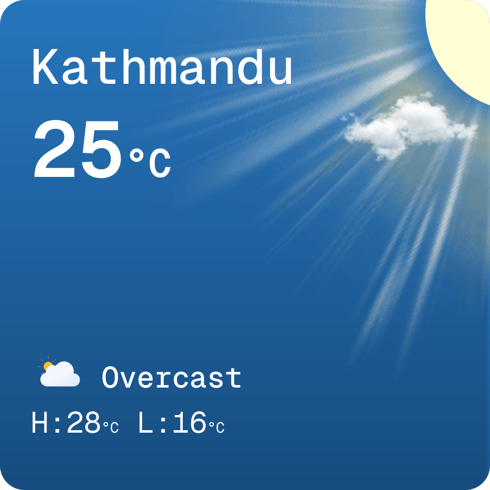</a><br>Weather</td>
    <td align="center"><a href="assets/weather-minimal.svg"></a><br>Weather minimal</td>
    <td align="center"><a href="assets/weather-forecast.svg">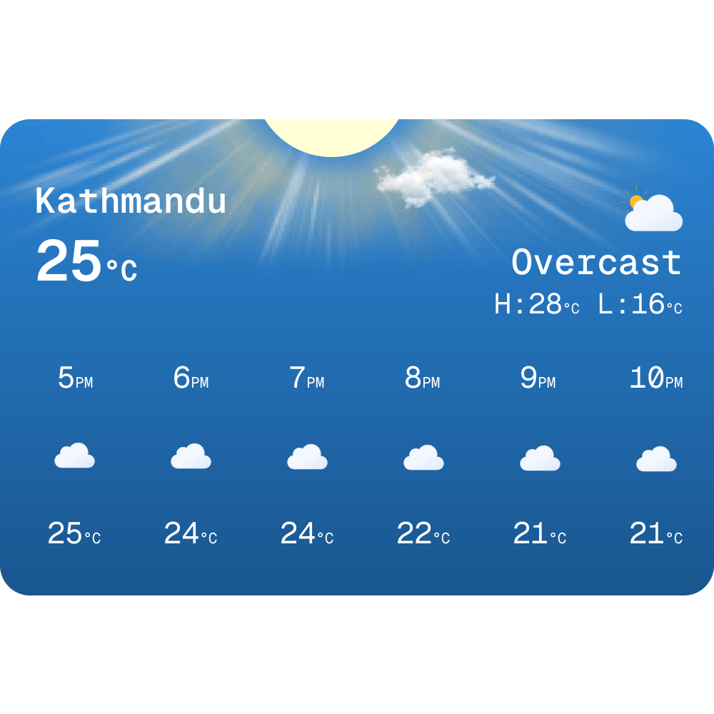</a><br>Weather forecast</td>
    <td align="center"><a href="assets/music-large.svg">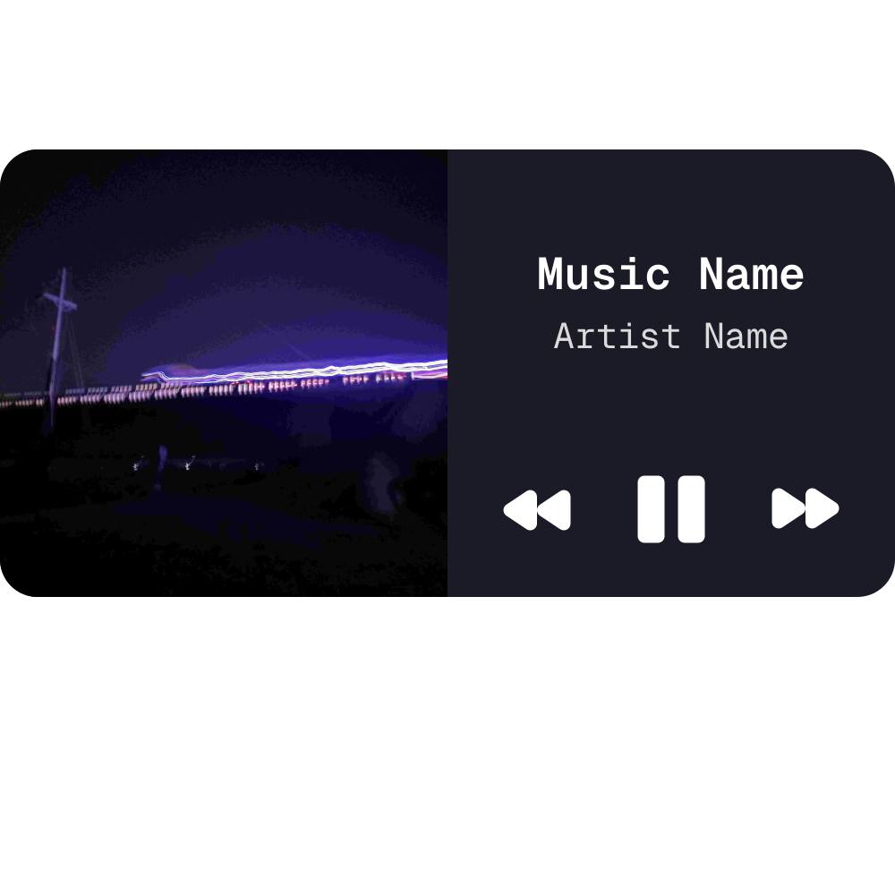</a><br>Music</td>
  </tr>
</table>


If anything here errors or you can't get something working, open an issue on
this repo and I'll do my best to help when I'm free.
